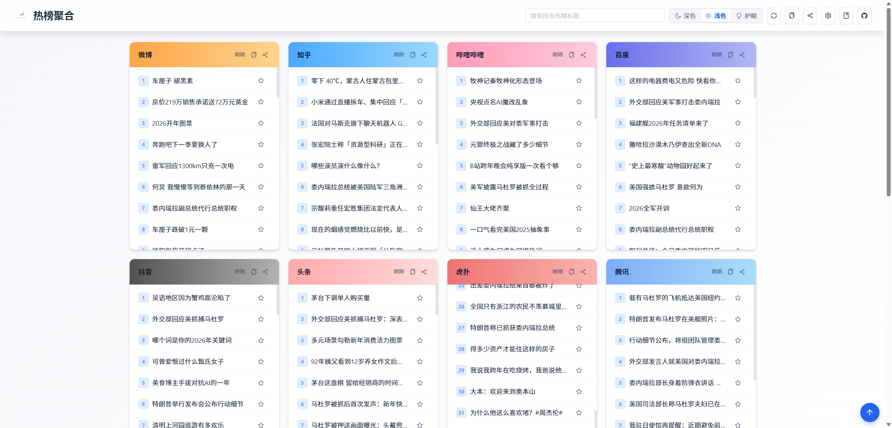
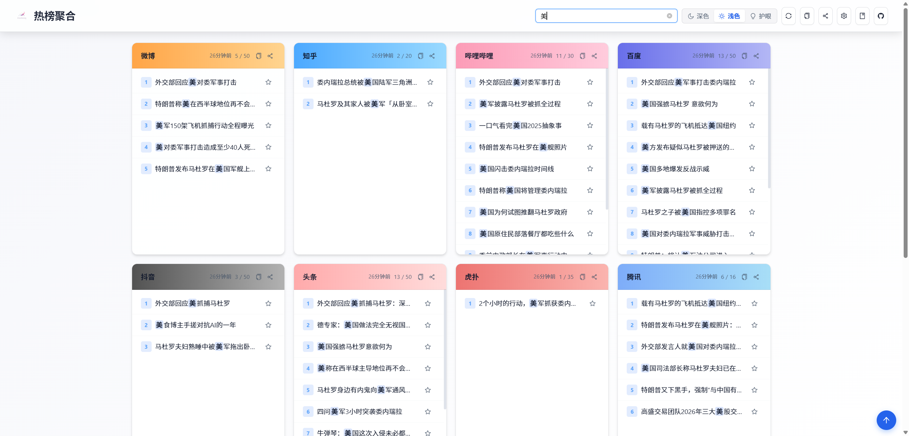
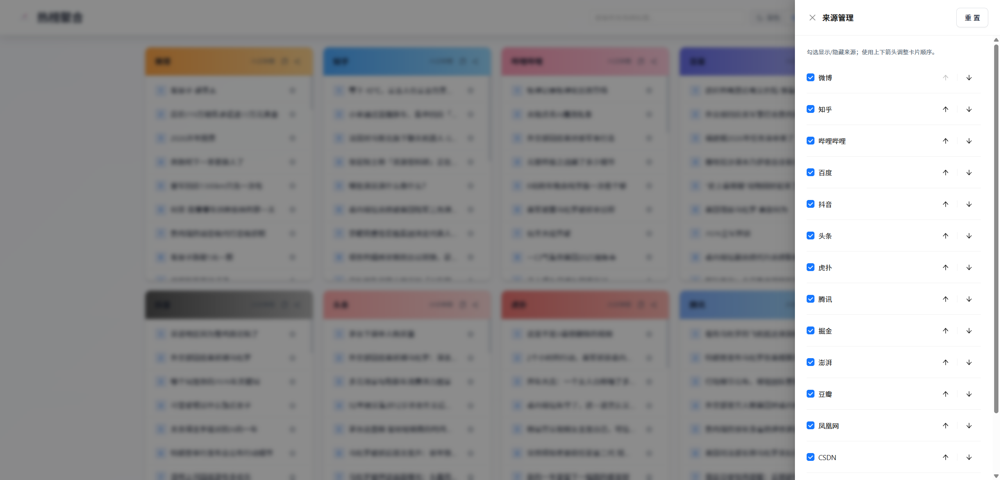
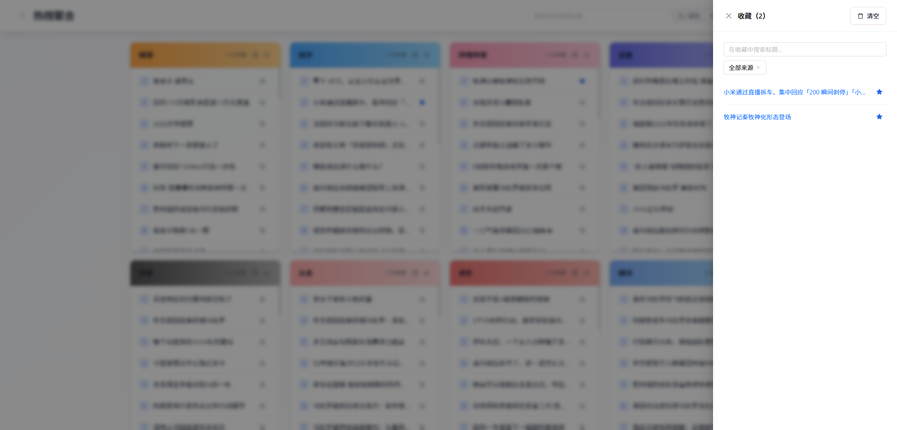
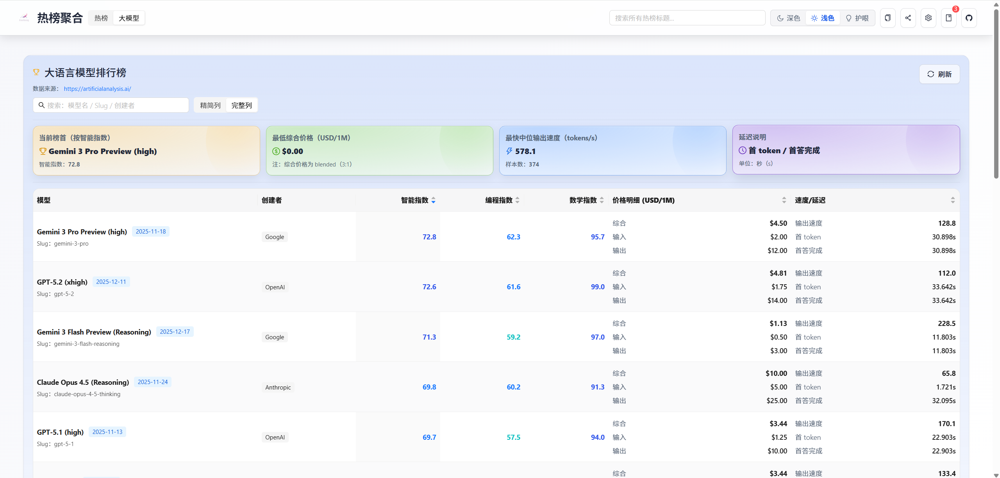
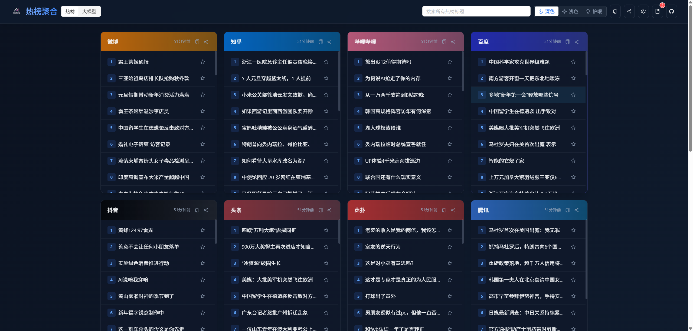
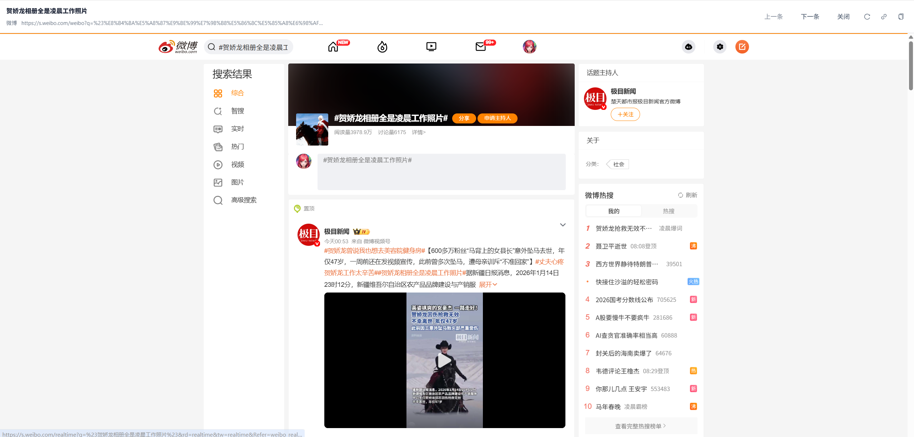

<p align="right">
  <strong>中文</strong> | <a href="README_EN.md">English</a>
</p>

<p align="center">
  
  <h1 align="center">Aneiang.Pa.News - 全网热点聚合平台</h1>
  <p align="center">
    <a href="https://github.com/AneiangSoft/Aneiang.Pa.News/stargazers">
      
    </a>
    <a href="https://github.com/AneiangSoft/Aneiang.Pa.News/network/members">
      
    </a>
    <a href="https://github.com/AneiangSoft/Aneiang.Pa.News/issues">
      
    </a>
    <a href="https://github.com/AneiangSoft/Aneiang.Pa.News/blob/master/LICENSE">
      
    </a>
    <a href="https://hub.docker.com/r/caco/aneiang-pa-news">
      
    </a>
  </p>
</p>


## 🌟 项目介绍

Aneiang.Pa.News 是一个现代化的热点/热搜聚合平台，提供“多源榜单聚合 + 舒适阅读体验 + 一键部署”的完整方案。后端负责抓取与缓存多平台热点，前端提供可定制的信息流展示与分享能力。

- **在线预览**：https://news.aneiang.com/
- **Docker 镜像**：`caco/aneiang-pa-news`（建议使用固定版本 tag，例如 `:1.0.7`）

## 📖 目录

- [功能一览](#-功能一览)
- [截图](#-截图)
- [技术栈](#-技术栈)
- [快速开始](#-快速开始)
- [配置说明](#-配置说明)
- [常见问题（FAQ）](#-常见问题faq)
- [项目结构](#-项目结构)
- [贡献指南](#-贡献指南)
- [开源协议](#-开源协议)
- [致谢](#-致谢)
- [联系我们](#-联系我们)

## ✨ 功能一览

- **多平台聚合**：整合微博、知乎、百度、今日头条等主流平台热榜。
- **来源管理**：拖拽排序、隐藏/显示来源，按你的习惯定制信息流。
- **阅读模式**：支持站内抽屉阅读 / 新标签页打开。
- **主题与外观**：浅色、深色、护眼主题 + 自定义主题色。
- **收藏夹**：收藏热点，便于回看。
- **分享能力**：海报分享、Markdown 快照复制、筛选条件分享链接。
- **大模型排行榜**：可选功能（由后端控制开关）。
- **部署友好**：Docker 一键部署，开箱即用。

## 📸 截图
- 
- 
- 
- 
- 
- 
- 
- 
- 

> PS: 项目基于 **Aneiang.Pa** 爬虫库实现，有兴趣的小伙伴可以点击了解：
> - **Github**: https://github.com/AneiangSoft/Aneiang.Pa
> - **Gitee**: https://gitee.com/AneiangSoft/Aneiang.Pa

## 技术栈

### 前端 (`Pa.HotNews.Web`)
- **框架**：React 19 (JavaScript, JSX)
- **构建工具**：Vite 7.x
- **UI 组件库**：Ant Design 6.x
- **路由**：React Router v7
- **HTTP 客户端**：Axios
- **代码规范**：ESLint

### 后端 (`Pa.HotNews.Api`)
- **运行时**：.NET 8
- **Web 框架**：ASP.NET Core 8
- **HTTP 客户端**：HttpClientFactory
- **依赖注入**：内置 DI 容器
- **日志系统**：Serilog
- **配置管理**：JSON + 环境变量

## 🚀 快速开始

### 方式 A：使用 Docker 部署（推荐）

确保已安装 Docker 和 Docker Compose。

#### 1. 使用 `docker run`

```bash
# 拉取最新镜像
docker pull caco/aneiang-pa-news:1.0.7

# 准备日志目录
mkdir -p logs

# 运行容器
docker run -d --name aneiang-pa-news \
  -p 5000:8080 \
  -e ASPNETCORE_URLS=http://+:8080 \
  -e ASPNETCORE_ENVIRONMENT=Production \
  -e Scraper__CacheProvider=Memory \
  caco/aneiang-pa-news:1.0.7
```

#### 2. 使用 `docker-compose`

仓库内提供了 `docker-compose.yml` 示例。下面给出两个版本：

**最小可运行（Memory 缓存，复制即可跑）**：

```yaml
services:
  hotnews:
    image: caco/aneiang-pa-news:1.0.7
    container_name: aneiang-pa-news
    ports:
      - "5000:8080"
    environment:
      ASPNETCORE_URLS: "http://+:8080"
      ASPNETCORE_ENVIRONMENT: "Production"

      # 爬虫缓存（Memory）
      Scraper__CacheProvider: "Memory"
      Scraper__CacheDuration: "00:30:00"

    volumes:
      - ./logs:/app/logs
    restart: unless-stopped
```

**增强版（Redis 缓存，推荐）**：

> ⚠️ 注意：请把下面的 Redis 地址、密码等改成你自己的；建议不要把真实密码提交到公开仓库。

```yaml
services:
  hotnews:
    image: caco/aneiang-pa-news:1.0.7
    container_name: aneiang-pa-news
    ports:
      - "5000:8080"
    environment:
      ASPNETCORE_URLS: "http://+:8080"
      ASPNETCORE_ENVIRONMENT: "Production"

      # 爬虫缓存（Redis）
      Scraper__CacheProvider: "Redis"
      Scraper__CacheDuration: "00:30:00"
      Scraper__Redis__Configuration: "<redis-host>:6379,password=<redis-password>,defaultDatabase=3"
      Scraper__Redis__InstanceName: "Aneiang.Pa:"

      # 站点信息（页眉/页脚）
      Site__Title: "Aneiang 热榜聚合"
      Site__TitleSuffix: " - 全网热点实时聚合"
      Site__IcpLicense: "湘ICP备2023022000号-2"

      # 大模型排行榜（可选）
      # LlmRanking__ApiKey: "<your-api-key>"

    volumes:
      - ./logs:/app/logs
    restart: unless-stopped
```

然后启动服务：

```bash
# 准备日志目录
mkdir -p logs

# 启动服务
docker compose up -d

# 更新服务（拉取新镜像并重启）
# docker compose pull && docker compose up -d
```

启动后：

- **Web 首页**：`http://localhost:5000/`
- **API 文档**：`http://localhost:5000/swagger`（仅当 `ASPNETCORE_ENVIRONMENT` 设置为 `Development` 时可用）

### 方式 B：从源码构建（用于开发）

#### 先决条件

- .NET 8.0 SDK 或更高版本
- Node.js 18+ 和 npm 9+
- Git

#### 1. 克隆仓库

```bash
git clone https://github.com/AneiangSoft/Aneiang.Pa.News.git
cd Aneiang.Pa.News
```

#### 2. 启动后端服务

```bash
cd Pa.HotNews.Api
dotnet restore
dotnet run
```
后端服务将运行在 `http://localhost:8080`。

#### 3. 启动前端开发服务器

打开一个新的终端窗口：

```bash
cd Pa.HotNews.Web
npm install
npm run dev
```
前端开发服务器将运行在 `http://localhost:5173`。它已通过 `vite.config.js` 配置了代理，所有 `/api` 请求都会被转发到 `http://localhost:8080`，实现前后端联调。

## 📦 项目结构

```
Aneiang.Pa.News/
├── docments/           # 文档和截图
├── Pa.HotNews.Api/     # .NET Web API 后端项目
│   ├── Controllers/    # API 控制器
│   ├── Services/       # 业务逻辑
│   └── Program.cs      # 应用入口
├── Pa.HotNews.Web/     # React 前端项目
│   ├── public/         # 静态资源
│   ├── src/
│   │   ├── components/ # React 组件
│   │   ├── hooks/      # 自定义 Hooks
│   │   ├── services/   # API 请求服务
│   │   ├── utils/      # 工具函数
│   │   ├── App.jsx     # 应用根组件
│   │   └── main.jsx    # 应用入口
│   ├── vite.config.js  # Vite 配置文件（含代理）
│   └── package.json
└── docker-compose.yml  # Docker Compose 配置文件
```

## 🔧 配置说明

### 后端环境变量 (Docker)

| 环境变量 | 说明 | 示例/默认 |
|---------|------|----------|
| `ASPNETCORE_ENVIRONMENT` | 环境名称 | `Production` |
| `ASPNETCORE_URLS` | 服务监听地址 | `http://+:8080` |
| `Site__Title` | 站点标题 | `Aneiang 热榜聚合` |
| `Site__TitleSuffix` | 标题后缀 | ` - 全网热点实时聚合` |
| `Site__IcpLicense` | ICP 备案号（页脚展示） | `湘ICP备2023022000号-2` |
| `LlmRanking__ApiKey` | 大模型排行榜 API Key | 空 |
| `Scraper__CacheProvider` | 爬虫缓存提供者 | `Redis` / `Memory` |
| `Scraper__CacheDuration` | 爬虫缓存时长 | `00:30:00` |
| `Scraper__Redis__Configuration` | Redis 连接串 | `host:6379,password=***,defaultDatabase=3` |
| `Scraper__Redis__InstanceName` | Redis Key 前缀 | `Aneiang.Pa:` |

## ❓ 常见问题（FAQ）

### 1) 为什么访问不了网页？

- 请确认容器已启动：`docker ps`
- 端口映射是否正确：示例使用 `-p 5000:8080`，因此访问 `http://localhost:5000/`
- 若你自行修改了端口，请以你实际映射端口为准

### 2) Redis 是必须的吗？

不是。缓存支持两种模式：

- `Scraper__CacheProvider=Memory`：开箱即用，适合单实例/轻量部署
- `Scraper__CacheProvider=Redis`：适合多实例/更高并发/更强一致性需求

### 3) 大模型排行榜如何开启/关闭？

该功能由后端 `/api/features` 控制是否启用。不同部署环境可能有不同默认策略。

- 若你希望默认关闭/开启，建议在部署时通过配置或环境变量（如项目提供）进行控制

## 🤝 贡献指南

欢迎提交 Issue 和 Pull Request。在提交代码前，请确保：

1. Fork 项目到你的 GitHub 账户
2. 创建特性分支 (`git checkout -b feature/AmazingFeature`)
3. 提交更改 (`git commit -m 'Add some AmazingFeature'`)
4. 推送到分支 (`git push origin feature/AmazingFeature`)
5. 打开 Pull Request

## 📄 开源协议

本项目采用 [MIT 许可证](LICENSE)。

## 🙏 致谢

- [.NET](https://dotnet.microsoft.com/) - 强大的跨平台开发框架
- [Aneiang.Pa](https://pa.aneiang.com/) - 功能丰富的 .NET 模块化爬虫库
- [React](https://reactjs.org/) - 用于构建用户界面的 JavaScript 库
- [Ant Design](https://ant.design/) - 企业级 UI 设计语言
- [Vite](https://vitejs.dev/) - 下一代前端工具链
- [ArtificialAnalysis](https://artificialanalysis.ai/) - 大模型排行榜数据源

## 📞 联系我们

- 邮箱：aneiang@qq.com
- GitHub Issues: [https://github.com/AneiangSoft/Aneiang.Pa.News/issues](https://github.com/AneiangSoft/Aneiang.Pa.News/issues)
