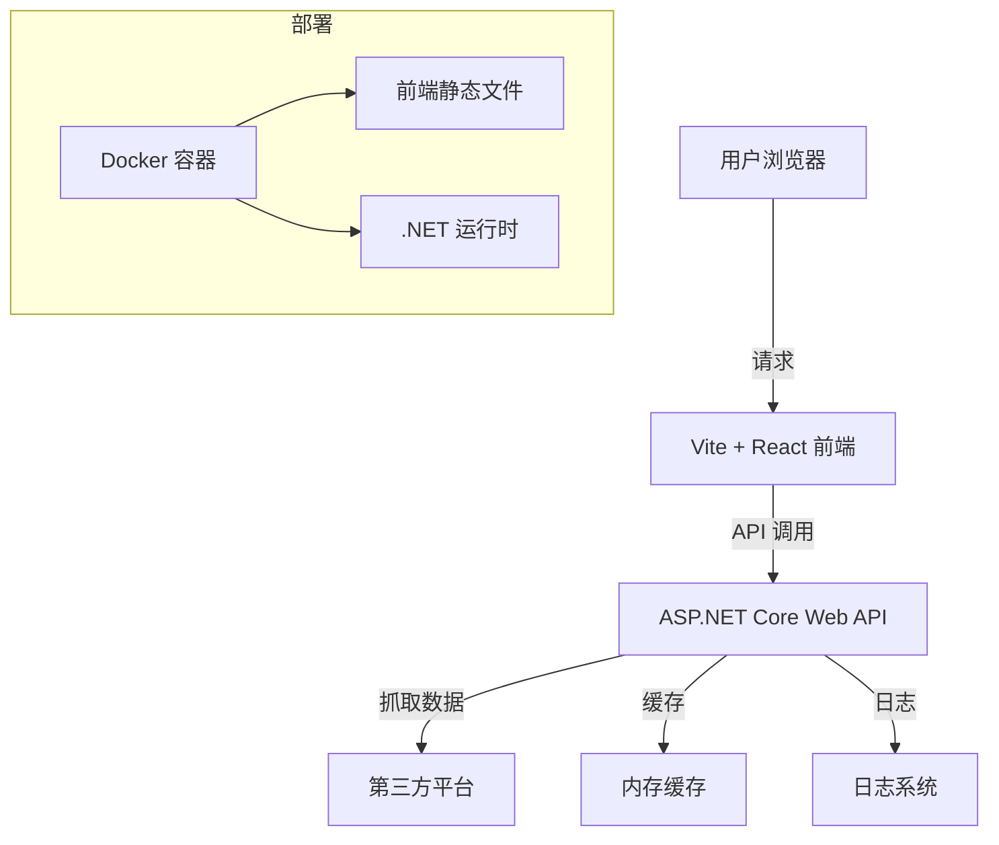

<p align="center">
  
  <h1 align="center">Aneiang.Pa.News - 全网热点聚合平台</h1>
  <p align="center">
    <a href="https://github.com/AneiangSoft/Aneiang.Pa.News/stargazers">
      
    </a>
    <a href="https://github.com/AneiangSoft/Aneiang.Pa.News/network/members">
      
    </a>
    <a href="https://github.com/AneiangSoft/Aneiang.Pa.News/issues">
      
    </a>
    <a href="https://github.com/AneiangSoft/Aneiang.Pa.News/blob/master/LICENSE">
      
    </a>
    <a href="https://hub.docker.com/r/caco/aneiang-pa-news">
      
    </a>
  </p>
</p>


## 🌟 项目介绍

Aneiang.Pa.News 是一个现代化的热点/热搜聚合平台，旨在为用户提供一站式的热点资讯浏览体验。通过智能抓取多个主流平台的热点内容，结合优雅的界面设计，让用户能够快速了解全网热点。

### ✨ 主要特性

- **多平台聚合**：整合微博、知乎、百度、今日头条等多个平台的热搜榜单
- **智能排序**：根据热度、时间等多维度智能排序
- **实时更新**：定时抓取最新热点，保持内容新鲜度
- **响应式设计**：完美适配桌面和移动设备
- **暗黑模式**：支持系统主题切换，保护眼睛
- **大模型排行榜**：集成大语言模型性能排行榜（需配置API Key）
- **Docker支持**：开箱即用的Docker镜像，支持快速部署

### 🚀 在线体验

- 在线预览：[https://news.aneiang.com/](https://news.aneiang.com/)
- Docker 镜像：`caco/aneiang-pa-news`（建议使用固定版本 tag，例如 `:1.0.5`）

## 🏗️ 系统架构



## 🛠️ 技术栈

### 前端
- **框架**：React 18 + TypeScript
- **构建工具**：Vite 4
- **UI 组件库**：Ant Design 5.x
- **状态管理**：React Context API
- **HTTP 客户端**：Axios
- **代码规范**：ESLint + Prettier

### 后端
- **运行时**：.NET 8
- **Web 框架**：ASP.NET Core 8
- **HTTP 客户端**：HttpClientFactory
- **依赖注入**：内置 DI 容器
- **日志系统**：Serilog
- **配置管理**：JSON + 环境变量

## 🚀 快速开始

### 方式 A：使用 Docker 部署（推荐）

确保已安装 Docker 和 Docker Compose。

#### 1. 使用 `docker run`

```bash
# 拉取最新镜像
docker pull caco/aneiang-pa-news:1.0.5

# 准备日志目录
mkdir -p logs

# 运行容器
docker run -d --name aneiang-pa-news \
  -p 5000:8080 \
  -e ASPNETCORE_URLS=http://+:8080 \
  -e ASPNETCORE_ENVIRONMENT=Production \
  -e HotNews__EnableCache=true \
  -e HotNews__CacheSeconds=1800 \
  -v $(pwd)/logs:/app/logs \
  --restart unless-stopped \
  caco/aneiang-pa-news:1.0.5
```

#### 2. 使用 `docker compose`

仓库内提供了两份示例：
- `docker-compose.yml`：简单版（默认内存缓存/兼容配置）
- `owin-docker-compose.yml`：增强版（推荐：Redis 缓存 + 站点信息 + LLM 排行配置）

**简单版（内存缓存）**：

```yaml
services:
  hotnews:
    image: caco/aneiang-pa-news:1.0.5
    container_name: aneiang-pa-news
    ports:
      - "5000:8080"
    environment:
      ASPNETCORE_URLS: "http://+:8080"
      ASPNETCORE_ENVIRONMENT: "Production"
      Scraper__CacheProvider: "Memory"
      Scraper__CacheDuration: "00:30:00"
    volumes:
      - ./logs:/app/logs
    restart: unless-stopped
```

**增强版（Redis 缓存，推荐）**：

> ⚠️ 注意：请把下面的 Redis 地址、密码、数据库等改成你自己的；建议不要把真实密码提交到公开仓库。

```yaml
services:
  hotnews:
    image: caco/aneiang-pa-news:1.0.5
    container_name: aneiang-pa-news
    ports:
      - "5000:8080"
    environment:
      ASPNETCORE_URLS: "http://+:8080"
      ASPNETCORE_ENVIRONMENT: "Production"

      # 爬虫缓存（Redis）
      Scraper__CacheProvider: "Redis"
      Scraper__CacheDuration: "00:30:00"
      Scraper__Redis__Configuration: "<redis-host>:6379,password=<redis-password>,defaultDatabase=3"
      Scraper__Redis__InstanceName: "Aneiang.Pa:"

      # 站点信息（页眉/页脚）
      Site__Title: "Aneiang 热榜聚合"
      Site__TitleSuffix: " - 全网热点实时聚合"
      Site__IcpLicense: "湘ICP备2023022000号-2"

      # 大模型排行榜（可选）
      # LlmRanking__ApiKey: "<your-api-key>"

    volumes:
      - ./logs:/app/logs
    restart: unless-stopped
```

然后启动服务：

```bash
# 准备日志目录
mkdir -p logs

# 启动服务
docker compose up -d

# 更新服务（拉取新镜像并重启）
# docker compose pull && docker compose up -d
```

启动后：

- Web 首页：`http://localhost:5000/`
- API 文档：`http://localhost:5000/swagger`（仅当 `ASPNETCORE_ENVIRONMENT` 设置为 `Development` 时可用）

### 方式 B：从源码构建

#### 先决条件

- .NET 8.0 SDK 或更高版本
- Node.js 18+ 和 npm 9+
- Git

#### 克隆仓库

```bash
git clone https://github.com/AneiangSoft/Aneiang.Pa.News.git
cd pa-news
```

#### 后端服务

```bash
cd Pa.HotNews.Api
dotnet restore
dotnet run
```

#### 前端开发

```bash
cd Pa.HotNews.Web
npm install
npm run dev
```

## 📦 项目结构

```
pa-news/
├── docments/           # 文档和截图
├── Pa.HotNews.Api/     # .NET Web API 项目
│   ├── Controllers/    # API 控制器
│   ├── Models/         # 数据模型
│   ├── Services/       # 业务逻辑
│   └── Program.cs      # 应用入口
├── Pa.HotNews.Web/     # React 前端项目
│   ├── public/         # 静态资源
│   ├── src/
│   │   ├── components/ # 公共组件
│   │   ├── pages/      # 页面组件
│   │   ├── services/   # API 服务
│   │   └── App.tsx     # 根组件
│   └── vite.config.ts  # Vite 配置
└── docker-compose.yml  # Docker Compose 配置
```

## 🔧 配置说明

### 基本配置

通过环境变量或 `appsettings.json` 配置：

```json
{
  "Site": {
    "Title": "Aneiang 热榜聚合",
    "TitleSuffix": " - 全网热点实时聚合",
    "IcpLicense": "湘ICP备2023022000号-2"
  },
  "HotNews": {
    "EnableCache": true,
    "CacheSeconds": 1800
  },
  "LlmRanking": {
    "ApiKey": ""
  }
}
```

### Docker 环境变量

> 说明：项目同时支持两套缓存配置：
> - `HotNews__*`：旧版/兼容配置（内存缓存）
> - `Scraper__*`：新版爬虫缓存配置（支持 Redis）
>
> 如果你使用 `owin-docker-compose.yml`，推荐使用 `Scraper__* + Redis`（性能更好，支持多实例共享缓存）。

| 环境变量 | 说明 | 示例/默认 |
|---------|------|----------|
| `ASPNETCORE_ENVIRONMENT` | 环境名称 | `Production` |
| `ASPNETCORE_URLS` | 服务监听地址 | `http://+:8080` |
| `Site__Title` | 站点标题 | `Aneiang 热榜聚合` |
| `Site__TitleSuffix` | 标题后缀 | ` - 全网热点实时聚合` |
| `Site__IcpLicense` | ICP 备案号（页脚展示） | `湘ICP备2023022000号-2` |
| `LlmRanking__ApiKey` | 大模型排行榜 API Key | 空 |
| `HotNews__EnableCache` | 是否启用缓存（兼容） | `true` |
| `HotNews__CacheSeconds` | 缓存时间(秒)（兼容） | `1800` |
| `Scraper__CacheProvider` | 爬虫缓存提供者 | `Redis` / `Memory` |
| `Scraper__CacheDuration` | 爬虫缓存时长 | `00:30:00` |
| `Scraper__Redis__Configuration` | Redis 连接串 | `host:6379,password=***,defaultDatabase=3`（支持更多参数） |
| `Scraper__Redis__InstanceName` | Redis Key 前缀（命名空间） | `Aneiang.Pa:` |

## 🤝 贡献指南

欢迎提交 Issue 和 Pull Request。在提交代码前，请确保：

1. Fork 项目到你的 GitHub 账户
2. 创建特性分支 (`git checkout -b feature/AmazingFeature`)
3. 提交更改 (`git commit -m 'Add some AmazingFeature'`)
4. 推送到分支 (`git push origin feature/AmazingFeature`)
5. 打开 Pull Request

## 📄 开源协议

本项目采用 [MIT 许可证](LICENSE)。

## 🙏 致谢

- [.NET](https://dotnet.microsoft.com/) - 强大的跨平台开发框架
- [Aneiang.Pa](https://pa.aneiang.com/) - 功能丰富的 .NET 模块化爬虫库
- [React](https://reactjs.org/) - 用于构建用户界面的 JavaScript 库
- [Ant Design](https://ant.design/) - 企业级 UI 设计语言
- [Vite](https://vitejs.dev/) - 下一代前端工具链
- [ArtificialAnalysis](https://artificialanalysis.ai/) - 大模型排行榜数据源

## 📞 联系我们

- 邮箱：aneiang@qq.com
- GitHub Issues: [https://github.com/AneiangSoft/Aneiang.Pa.News/issues](https://github.com/AneiangSoft/Aneiang.Pa.News/issues)

---